# make_db — Project Specification

> Source of truth for all schemas, vocabularies, tool specs, and the agent loop.

---

## 1. What This Does

Builds a vector database of architecture projects for ArchiTinder — a swipe-based recommendation app. Users swipe buildings (like/skip) and the engine finds visually + programmatically similar ones using vector similarity (Netflix-style).

**Two repos:**
- `make_db` — builds and maintains the database (this repo)
- `make_web` — Django backend + React frontend that reads from it

---

## 2. Architecture

5 stages, each owning one code subpackage AND one data sub-folder.

> **5-stage pipeline ≠ phase numbering.** The pipeline below is the
> structural shape of the data flow — always the same regardless of
> source. "Phase 0/1/.../11" in the roadmap (`db-fuzzy-lerdorf.md`)
> and `Task.md` are time-order *work units*, not stages. One phase
> usually touches one stage; cross-stage phases (e.g. Phase 11) are
> labelled at the file level. See §12 for the full distinction.

### 2.1 Pipeline data flow

```mermaid
flowchart LR
    %% External sources
    METALOC[/"metalocus.es"/]:::ext
    DIVISARE[/"divisare.com"/]:::ext

    %% Stage 1 — Crawl
    subgraph S1["① crawl/  (per-source raw scraping)"]
        ML[("data/crawl/<br/>metalocus.db")]
        DV[("data/crawl/<br/>divisare.db")]
        IMG[/"images/{building_id}/"/]
    end
    METALOC --> ML
    METALOC --> IMG
    DIVISARE --> DV

    %% Stage 2-3 — Enrich
    subgraph S2["②③ enrich/  (LLM text + image extraction)"]
        RAW[/"1_buildings_raw.json"/]
        EN[/"2_buildings_enriched.json"/]
        AN[/"3_buildings_analyzed.json"/]
        FIN[/"4_buildings_final.json<br/>(with embeddings)"/]
        TQ[("tasks.db<br/>queue")]
    end
    ML -- "export.py" --> RAW
    RAW -- "harness +<br/>llm_parser" --> EN
    EN -- "harness +<br/>image_analysis" --> AN
    AN -- "embed.py" --> FIN
    TQ -. drives .-> EN
    TQ -. drives .-> AN

    %% Stage 4 — Canonical
    subgraph S4["④ canonical/  (matching + canonical artefact)"]
        CL[/"metalocus_architect_<br/>clusters.json"/]
        AM[/"match/architect_<br/>to_divisare.json"/]
        BM[/"match/building_<br/>to_divisare.json"/]
        CB[/"canonical_buildings_<br/>strict.json"/]
    end
    FIN -- "consolidate" --> CL
    CL -- "match_architects" --> AM
    DV --> AM
    FIN -- "match_buildings" --> BM
    AM --> BM
    DV --> BM
    BM -- "build --strict" --> CB
    AM --> CB
    FIN --> CB

    %% Stage 5 — Upload
    subgraph S5["⑤ upload/  (Neon + R2 — manual gate)"]
        NEON[("Neon Postgres<br/>architecture_vectors")]
        R2[("Cloudflare R2<br/>images")]
    end
    CB -- "neon_strict" --> NEON
    IMG -- "neon (R2 part)" --> R2

    classDef ext fill:#fff5e6,stroke:#cc8a00,stroke-width:2px,color:#000
    classDef stage fill:#f5f5f5,stroke:#666,stroke-width:1px,color:#000
    class S1,S2,S4,S5 stage
```



### 2.2 Code ↔ data correspondence

| Stage | Code package | Data folder | Source-of-truth artefact |
|---|---|---|---|
| 1. Crawl | `crawl/{source}/` | `data/crawl/` | `*.db` per source |
| 2-3. Enrich | `enrich/` | `data/enrich/` | `4_buildings_final.json` |
| 4. Canonical | `canonical/` | `data/canonical/` | `canonical_buildings_strict.json` |
| 5. Upload | `upload/` | (none — writes to Neon/R2) | `architecture_vectors` table |
| Shared | `core/` | `data/id_registry.json`, `data/reports/` | — |

**New crawl source = new directory under `crawl/<source>/`** + a parallel
`data/crawl/<source>.db`. The per-source crawler enqueues into its own
SQLite; downstream stages read it via `crawl.<source>.db` helpers.

### 2.3 Two-machine split (current operating mode)

```mermaid
flowchart LR
    subgraph OFFICE["Office computer (large disk)"]
        OC[crawl/metalocus<br/>+ enrich/harness<br/>+ images/]
        OD[("metalocus.db<br/>tasks.db<br/>4_buildings_final.json")]
    end
    subgraph LAPTOP["Laptop (small disk)"]
        LC[crawl/divisare<br/>--phase enqueue-lite<br/>--phase projects]
        LD[("divisare.db<br/>(deep-fetched)")]
    end
    DBOX{"Dropbox<br/>(code + small JSON only;<br/>SQLite excluded per machine)"}
    OD <-.code,<br/>4_buildings_final.json.-> DBOX
    LD <-.code,<br/>match outputs.-> DBOX
    OC -- selective sync excludes<br/>data/crawl/divisare.db --> DBOX
    LC -- selective sync excludes<br/>data/crawl/metalocus.db<br/>data/enrich/tasks.db<br/>images/ --> DBOX
```

Both machines write disjoint SQLite files → no Dropbox sync corruption.
Final canonical assembly happens on the laptop (where `divisare.db` is
freshest); R2 image upload happens on the office machine (where the
60 GB of images live).

---

## 3. File Structure

5-stage subpackage layout (mirrors the workflow). New crawl source =
new directory under `crawl/`.

```
make_db/
├── CLAUDE.md                  ← Claude session instructions (entry point)
├── AGENTS.md                  ← Codex CLI baseline (Phase 15)
├── .claude/PROJECT.md         ← This file: full spec
├── .claude/REPORT.md          ← Current state + status
├── .claude/WORKFLOW.md        ← operational Cases + Phase 15 self-heal loop
├── .claude/Goal.md  / Task.md
├── .claude/agents/            ← team-* (Phase 15) + legacy in-session sub-agents
│   ├── orchestrator.md            ← DB-MAIN router (dispatch.sh)
│   ├── team-crawler.md            ← DB-CRAWLER lead (codex)
│   ├── team-matcher.md            ← DB-MATCHER lead (codex)
│   ├── team-enricher.md           ← DB-ENRICHER lead (codex)
│   ├── team-reviewer.md           ← DB-REVIEWER lead (claude)
│   ├── reporter.md / researcher.md / upload-guard.md / git-manager.md
│   └── quality-reviewer.md / batch-worker.md / batch-enricher.md  [DEPRECATED]
├── .claude/escalations/       ← Phase 15 reviewer BLOCK diagnoses (gitignored)
├── run.py                     ← Unified CLI (sole script at root)
├── requirements.txt
├── .env                       ← gitignored
│
├── core/                      ← Shared infrastructure
│   ├── vocab.py               ← Canonical vocab + migrations + QC
│   ├── config.py              ← Paths + rate limits + Phase-15 caps
│   └── utils.py               ← Logger, rate limiter, HTTP, slugs
│
├── crawl/                     ← Stage 1: per-source raw scraping
│   ├── metalocus/             ← crawler / parsers / database / models / downloader
│   ├── divisare/              ← crawler / auth / db / parsers
│   ├── architizer/            ← crawler / db / parsers (Phase 7)
│   └── archello/              ← crawler / db / parsers (Phase 8)
│
├── enrich/                    ← Stages 2-3: text + image LLM
│   ├── export.py / dedup.py / embed.py
│   ├── harness.py / llm_parser.py / image_analysis.py / tasks_db.py
│   ├── quality.py / eval.py / label_golden.py
│   └── migrate_vocab.py / reprocess.py
│
├── canonical/                 ← Stage 4: matching + canonical artefact
│   ├── schema.py / registry.py
│   ├── consolidate.py / consolidate_helpers.py
│   ├── match_architects.py / match_architects_extended.py
│   ├── match_buildings.py / match_buildings_sequential.py / match_to_canonical.py
│   ├── manual_tiebreaks.py
│   ├── build.py / assemble_4source.py
│   ├── qc.py                  ← 10 invariant checks
│   ├── image_dedup.py         ← Phase 10 phash cluster + cover ranking
│   ├── reviewer_gate.py       ← Phase 15 blocking QC gate (Stage A/B/D/F)
│   ├── match_phash_check.py   ← Phase 15 has_phash_overlap() function
│   └── phash_cache.py         ← Phase 15 cache builder (CLI: --build)
│
├── upload/                    ← Stage 5: Neon + R2 (manual gate)
│   ├── neon.py                ← legacy 4_buildings_final upload + R2
│   └── neon_strict.py         ← strict canonical → in-place migration
│
├── tools/                     ← Dev utilities (not in pipeline)
│   ├── cmux_setup.sh          ← Phase 15: create 5 cmux workspaces
│   ├── dispatch.sh            ← Phase 15: DB-MAIN → other-tab cmux send
│   ├── poll.sh                ← Phase 15: read-screen on a team's tab
│   ├── divisare_server.py / divisare_gallery.html
│   ├── divisare_gap_check.py / divisare_smartsweep.py / divisare_topup.py
│   ├── generate_gallery.py / gallery.html
│   ├── build_d1_batches.py / build_round2_batches.py / build_tiebreak_*.py
│   ├── apply_*_results.py / split_code_diffs.py
│   └── rule_resolve_buildings.py / match_architects_regression.py
│
├── tests/                     ← unit tests (pytest)
│   ├── test_phash_check.py
│   └── test_phash_cache.py
│
├── data/                      ← Data artefacts, sub-divided by stage (gitignored)
│   ├── crawl/                 ← Stage 1: per-source DBs
│   │   ├── metalocus.db / divisare.db / architizer.db / archello.db (+ wal/shm)
│   │
│   ├── enrich/                ← Stages 2-3
│   │   ├── 1_buildings_raw.json / 2_buildings_enriched.json
│   │   ├── 3_buildings_analyzed.json / 4_buildings_final.json
│   │   ├── tasks.db / golden/ / few_shot/
│   │
│   ├── canonical/             ← Stage 4 outputs
│   │   ├── architects_canonical.json
│   │   ├── canonical_buildings_4source.json
│   │   ├── canonical_buildings_strict.json
│   │   ├── phash_cache.json + phash_cache_progress.json   (Phase 15)
│   │   ├── d1_batches_t2/ + d1_results_t2/   (T2 enrichment, suspended)
│   │   └── match/
│   │
│   ├── reports/               ← QC + audit
│   │   └── canonical_qc.json / rating_report.json / review_report.json /
│   │       fix_report.json / eval_report.json / vocab_migration.json
│   │
│   ├── id_registry_buildings.json / id_registry_architects.json   ← NEVER delete
│   └── .divisare_session.json ← gitignored auth cache
│
└── images/                    ← legacy per-source on-disk images (mostly empty
    └── {building_id}/             post-Phase 11 URL-only crawler change)
```

---

## 4. PostgreSQL Schema

```sql
CREATE EXTENSION IF NOT EXISTS vector;

CREATE TABLE architecture_vectors (
    building_id        TEXT PRIMARY KEY,     -- e.g. 'B00042', stable
    slug               TEXT UNIQUE NOT NULL,
    name_en            TEXT NOT NULL,        -- canonical English name
    project_name       TEXT NOT NULL,        -- display name, may be non-English
    architect          TEXT,
    location_country   TEXT,
    city               TEXT,
    year               INTEGER,
    area_sqm           NUMERIC,
    program            TEXT NOT NULL,        -- Section 5.1
    style              TEXT,                 -- Section 5.2, from image
    atmosphere         TEXT,                 -- Section 5.5, from enrichment/image
    color_tone         TEXT,                 -- Section 5.3, from image
    material           TEXT,                 -- from article text
    material_visual    TEXT[],               -- Section 5.4, from image
    description        TEXT,
    visual_description TEXT,                 -- prose from image, feeds embedding
    url                TEXT,
    tags               TEXT[],
    source_slugs       TEXT[],
    image_photos       TEXT[],               -- up to 3 filenames
    image_drawings     TEXT[],               -- up to 3 filenames
    vocab_version      TEXT DEFAULT 'v1',    -- vocab.py VOCAB_VERSION at write time
    prompt_version     TEXT,                 -- "{label}-{sha256(prompt)[:8]}"
    embedding          VECTOR(384) NOT NULL
);

CREATE INDEX ON architecture_vectors (program);
CREATE INDEX ON architecture_vectors (style);
CREATE INDEX ON architecture_vectors (color_tone);
CREATE INDEX ON architecture_vectors (location_country);
CREATE INDEX ON architecture_vectors (year);
```

**Embedding text** (what gets encoded into the vector):
```
name_en + architect + location_country + program + style + atmosphere +
color_tone + material_visual (joined) + visual_description + description
```

---

## 5. Controlled Vocabularies

Canonical source of truth: `vocab.py` (`VOCAB_VERSION = "v2"`). The lists below
mirror the code — if they diverge, `vocab.py` wins. Legacy v1 values (e.g.
"Expressionist", "Warm White") are migrated in `vocab.LEGACY_MIGRATIONS`.

### 5.1 `program` (14 values, unchanged v1→v2)
Housing, Office, Museum, Education, Religion, Sports, Transport,
Hospitality, Healthcare, Public, Mixed Use, Landscape, Infrastructure, Other

### 5.2 `style` (12 values, v2)
Minimalist, Brutalist, High-Tech, Postmodern, Vernacular, Contemporary,
Deconstructivist, Industrial, Neo-Classical, Organic, Modernist, Parametric

### 5.3 `color_tone` (8 values, v2)
Monochrome, Warm, Cool, Earth, Vibrant, Neutral, Dark, Light

### 5.4 `material_visual` (suggested, not strict)
concrete, glass, timber, brick, stone, steel, corten, aluminum, copper,
plaster, tile, marble, rammed earth, bamboo, polycarbonate, fabric

### 5.5 `atmosphere` (12 values, enforced as enum)
Serene, Dynamic, Raw, Warm, Urban, Industrial, Playful,
Monumental, Intimate, Futuristic, Rustic, Contemplative

---

## 6. Data File Sequence

| File | Produced by | Contains |
|------|------------|---------|
| `1_buildings_raw.json` | stage1_export + stage2_dedup | slug, project_name, architect, images, tags |
| `2_buildings_enriched.json` | Claude text enrichment | + name_en, program, material, atmosphere |
| `3_buildings_analyzed.json` | Claude image analysis | + style, color_tone, material_visual, visual_description |
| `4_buildings_final.json` | stage3_embed | + embedding (384-dim array) |

Each step adds fields. Earlier fields are preserved.

---

## 7. Tool Specifications

### `stage1_export.py`
- Reads SQLite → writes `1_buildings_raw.json`
- Skips buildings with no title or no cover image
- Renames images: `{filename}` → `{order}_{filename}` on disk
- Classifies images: photo vs drawing (alt_text keywords)
- Selects upload candidates: best 3 photos + 3 drawings per building

### `stage2_dedup.py`
- Preliminary embedding (throwaway) → fuzzy name match → cosine confirm
- Merges duplicates (keep richer, union images + tags)
- Assigns stable `building_id` (B00001 format)
- Moves `images/{slug}/` → `images/{building_id}/`
- Updates `id_registry.json`

### `stage3_embed.py`
- Reads `3_buildings_analyzed.json`
- Builds embedding text from all enriched + visual fields
- Encodes with `paraphrase-multilingual-MiniLM-L12-v2` → 384-dim
- Writes `4_buildings_final.json`

### `quality.py` (review + fix + rate + diagnose, consolidated in Phase 8A)
Invoke via `python3 run.py quality {review,fix,rate,diagnose}` or directly
`python3 quality.py <cmd>`.

**review**: required fields, null counts, vocabulary compliance, vocab_version
stamp, duplicate IDs, embedding dimensions. Output `review_report.json`:
```json
{
  "status": "pass|fail|warning",
  "field_coverage": { "style": {"filled": 255, "pct": 0.85} },
  "issues": [{"type": "null_field", "field": "style", "count": 45}],
  "recommendations": ["Run image analysis on 45 buildings missing style"]
}
```

**fix**: auto-normalize program/style/color_tone via `vocab.normalize_loose`;
fill atmosphere from legacy `mood`; clean architect / name_en / country.
Cannot auto-fix: missing visual_description, missing name_en. Writes an audit
log of every vocab rewrite to `fix_report.json`.

**rate**: scores 6 dimensions (0–100 each). Output `rating_report.json`:
```json
{
  "overall": 72,
  "dimensions": {
    "completeness":   {"score": 91, "note": "name_en 100%, style 85%"},
    "visual_depth":   {"score": 58, "note": "visual_description only 70% filled"},
    "description":    {"score": 78, "note": "avg 180 chars, target 200"},
    "image_coverage": {"score": 82, "note": "avg 2.8 photos, 1.1 drawings"},
    "diversity":      {"score": 64, "note": "Housing 42% — too high"},
    "scale":          {"score": 60, "note": "300 buildings, target 500"}
  },
  "weaknesses": ["visual_depth is lowest — run image analysis on missing buildings"],
  "judgment": "Not ready. Visual fields incomplete and count below target."
}
```

### `upload.py`
- UPSERT all buildings from `4_buildings_final.json` into PostgreSQL
- Create/update vector index (HNSW < 300 rows, IVFFlat ≥ 300 rows)
- Upload `image_photos` + `image_drawings` to R2
- **Only runs after user explicitly approves**

---

## 8. Crawler Content Filter

In `crawler.py:phase_articles()`, after `parse_article_page()`, before `db.save_building()`:

```python
_JUNK_TAGS = {"metalocus music project", "metalocus recommends"}
_JUNK_TITLES = [
    "music video", "video clip", "pritzker", "riba gold medal",
    "happy holidays", "merry christmas", "best for 20", "obituary",
]

def is_building_project(data) -> bool:
    if {t.lower() for t in data.tags} & _JUNK_TAGS:
        return False
    if any(kw in (data.title or "").lower() for kw in _JUNK_TITLES):
        return False
    if not data.architects and not data.area_sqm and not data.building_type:
        return False
    return True
```

If False → `db.mark_article_skipped()` → skip image download.

---

## 9. Agent Loop

The operational workflow lives in `.claude/WORKFLOW.md` — six Cases covering
new batch processing, quality iteration, targeted re-processing, prompt
tuning, vocabulary evolution, and the upload approval gate. Six agents
(`orchestrator`, `batch-worker`, `quality-reviewer`, `reporter`, `researcher`,
`upload-guard`) under `.claude/agents/` implement those Cases.

The single quality judgment that overrides any metric:

> **Will architects get meaningful, visually accurate recommendations from this database?**

If `quality rate` says 96/100 but the answer is no, it's no. If it says 72
and the answer is yes for the use case at hand, that's enough.

---

## 10. Quality Targets

Claude uses these as guidance, not hard gates. Judgment matters more than scores.

```
minimum_buildings:    500
required 100%:        building_id, name_en, program, embedding
required  90%:        architect, description, atmosphere, style
required  80%:        visual_description, material_visual, color_tone
program balance:      no single program > 35% of total
visual coverage:      avg ≥ 1 photo per building, ≥ 40% have ≥ 1 drawing
description length:   avg ≥ 200 chars
```

---

## 11. Adding a new crawl source — runbook

Use this checklist to add a 5th, 6th, … source. Each new source is a
**new directory under `crawl/<source>/`** with the same shape as the
existing four (metalocus, divisare, architizer, archello). The runbook
is the same regardless of whether the source is a static-HTML site, a
sitemap-driven site, or one requiring authentication.

### Step 1 — Recon (writes `.claude/research/<source>-schema.md`)

Dispatch a `researcher` agent (Phase 0 / `Case 5` in WORKFLOW.md). The
recon doc must answer:

1. Site overview — type of content, scale (project count), languages,
   geographic focus.
2. Access policy — public/paywalled, account-tier requirements.
3. **`robots.txt`** — fetch + quote, note any sitemap URLs, note
   `Content-Signal: ai-train=no` flags (EU DSM Art. 4) for user policy
   call.
4. Anti-bot — Cloudflare/Akamai? JS-rendered? Test with a sample fetch.
5. Auth strategy — if login needed.
6. URL patterns — listing / project / firm / tag pages.
7. Data shape — fetch one sample project, identify HTML/JSON-LD/OG
   selectors.
8. Pagination + discovery — sitemap, archives, search.
9. Rate limit estimate — observation + community reports.
10. Comparison vs existing sources — what's similar / unique value-add.
11. Feasibility verdict — easy / moderate / hard / hostile.

If multiple candidate sources are being investigated, also append a
row to `.claude/research/_crawl-targets.md` (cross-comparison table).

### Step 2 — User policy decision (`ai-train=no` / ToS scrape ban)

If the recon flags either of:
- a stated `Content-Signal: ai-train=no` reservation, or
- a ToS that explicitly prohibits "automatic device / robot / spider"

then **stop here** until the user decides: respect / override / negotiate.
Document the decision in the research doc. Do NOT write crawler code
without that gate cleared.

### Step 3 — Code skeleton (mirror Architizer or Archello)

Three files under `crawl/<source>/`:

```
crawl/<source>/
├── __init__.py     (empty package marker)
├── db.py           SQLite schema + queue helpers
├── parsers.py      HTML / sitemap / JSON parsing
└── crawler.py      phases + CLI entry (mirrors run_all + main pattern)
```

Pattern guidance:
- Use `crawl/architizer/` as the reference for **sitemap-driven public**
  sources (most common case): two-phase (sitemap → enqueue → deep-fetch).
- Use `crawl/divisare/` as the reference for **authenticated** sources:
  add an `auth.py` and a session refresh path; use a region-walk +
  architect-walk pattern when there's no published sitemap.
- Use `crawl/archello/` as the reference for sources with **per-project
  detail rows** (one-to-many child entities: products, photos, etc.).

Schema convention per source:
- One **entity table** per crawl-able noun (`<source>_projects`, optionally
  `<source>_firms`, `<source>_brands`, `<source>_awards`).
- One **detail table** if the source has structured per-project child
  rows (Archello has `archello_project_details`; Architizer has
  `architizer_awards`).
- One **`pending_*` queue table** per discovery axis with status
  enum `pending|done|failed`.
- Indexes on `pending_*.status`, plus per-entity `country` / `year` /
  `firm` indexes where the column is queryable.

URL-only image policy: never queue image rows for download at stage 1.
Persist `cover_image_url` + `gallery_image_urls` (JSON) + optionally
`drawing_image_urls` (JSON) on the entity row. Cover selection + R2
upload happen at stage 4 (`canonical/image_dedup` — Task.md Phase 10)
+ stage 5 (upload — Task.md Phase 9).

### Step 4 — `core/config.py` constants

Add a constant block for the new source mirroring the existing pattern:

```python
SOURCE_BASE_URL              = "https://example.com"
SOURCE_REQUEST_DELAY_SECONDS = 2.0   # respect robots.txt crawl-delay; default to ≥2s
SOURCE_USER_AGENT            = "Mozilla/5.0 ..."  # browser UA, not ClaudeBot
SOURCE_DB_PATH               = os.path.join(CRAWL_DIR, "<source>.db")
# If auth required:
SOURCE_LOGIN_URL             = "..."
SOURCE_SESSION_PATH          = os.path.join(DATA_DIR, ".source_session.json")
```

### Step 5 — `run.py` wiring

Add a `cmd_crawl_<source>` function + a `crawl-<source>` argparser block
that mirrors `cmd_crawl_architizer` / `cmd_crawl_divisare`. The user
should be able to run `python3 run.py crawl-<source> --phase ... --limit
N` without invoking the module directly.

### Step 6 — Smoke test

Per the recon's URL patterns:
1. Sitemap-discovery phase → verify `pending_*` queue gets populated
   with the expected row count.
2. Deep-fetch a small batch (`--limit 5` or `10`).
3. Inspect 3-5 random rows — name + key fields + cover_image_url
   populated; description length plausible.
4. Run for a longer batch (~100) and watch the log for redirect /
   timeout / parse errors.

If `core/utils.fetch_page` raises an unfamiliar `RequestException` type
that escapes the crawler's per-row try/except, fix `fetch_page` (it
should return `None` on terminal HTTP errors, not raise — see commit
2026-04-28 utils fix for the TooManyRedirects precedent).

### Step 7 — Wire into the canonical layer (Phase 9.5)

The crawler produces `data/crawl/<source>.db`. To make it part of the
strict canonical artefact:

- Extend `canonical/match_architects.py` to optionally match against
  the new source's architect/firm table.
- Extend `canonical/match_buildings.py` similarly for projects.
- Extend `canonical/build.py` to fold the new source's matches into
  `canonical_buildings_strict.json`, with provenance per field.
- Update `canonical/qc.py` invariants if the new source introduces a
  new field type.
- Update `.claude/REPORT.md` §1 (per-source crawl state) with row counts.
- Update `.claude/PROJECT.md` §3 file structure tree.

### Step 8 — Document + commit

- Add a 1-line entry to `.claude/Task.md ## Handoffs`:
  `RESEARCH-COMPLETE: <source>-schema` (after Step 1) and
  `IMPLEMENTATION-COMPLETE: <source>-crawler` (after Step 6).
- Commit per logical change (recon doc / crawler code / canonical
  extension are three separate commits).

---

## 12. Pipeline 5 stages vs Phase work-order — orthogonal

Two coordinate systems coexist:

- **Pipeline stages (1-5)** = the *structure* of the data flow. Always
  the same regardless of source: crawl → enrich → canonical → upload.
  See §2.1 mermaid. New code goes in the right stage's package.

- **Phases (0, 1, 2, …, 11, …)** = the *time-order* of work units (a
  feature, a refactor, a backfill). One phase typically touches one
  stage but not always — Phase 11 (metalocus URL-only) touched stages
  1, 2-3 because the URL-only switch propagates from crawl through
  enrich.

Phase numbering is intentionally a flat sequence (no "Phase 11.0a.iii"
sub-tree). When in doubt, just allocate the next number. The roadmap
file (`~/.claude/plans/db-fuzzy-lerdorf.md`) keeps phases in narrative
order; `Task.md` keeps the open / in-progress / resolved cuts.
