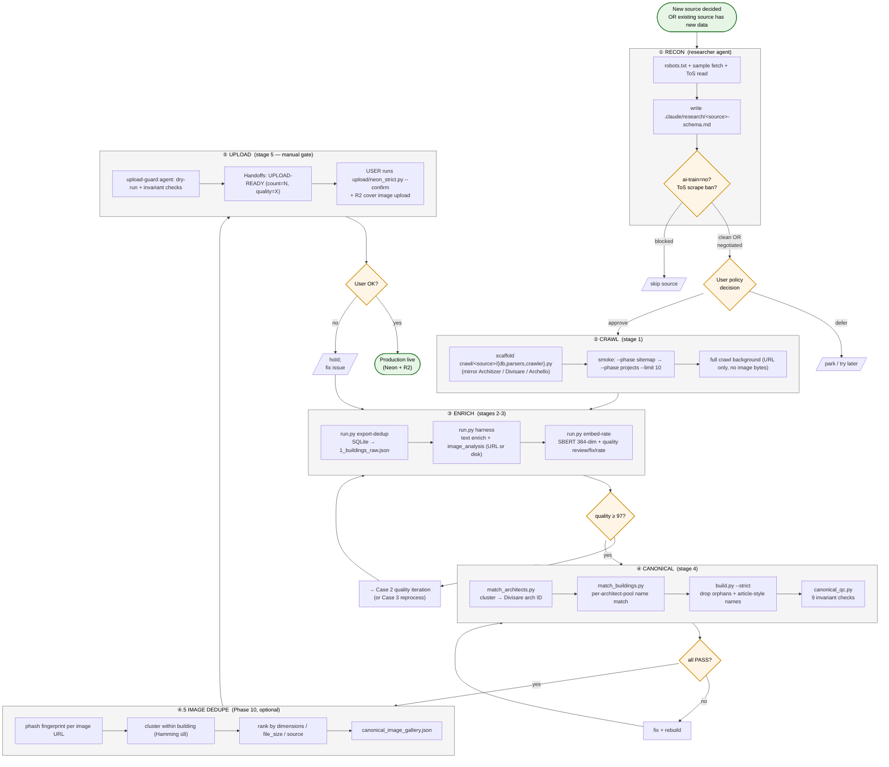

# make_db — Workflow

How the agent layer operates. Eight operational cases cover ~all real
work. Anything that doesn't fit goes through orchestrator for routing.

> **For data flow** (sources → DBs → JSON → Neon/R2) see PROJECT.md §2.1.
> This file documents *what humans / agents do, in what order*.

## End-to-end workflow (DB-build process)



**Reading the diagram:**
- ① Yellow diamonds = decision gates (require user OR auto-judgment).
- ② Each "phase box" maps to a code subpackage AND a Case (below).
- ③ Quality + canonical-QC failures bounce back to enrich; user-rejected
  upload bounces back to enrich. Linear forward path on the happy case.

The Cases section below describes the agent dispatch *inside* each
phase box (e.g., Case 7 details how recon happens; Case 1 details how a
batch enriches; Case 8 details canonical multi-source fold-in).

## Agents (7)

| Agent | Model | Role |
|---|---|---|
| `orchestrator` | opus | Top-level router. Reads Goal/Task/REPORT on every invocation. Dispatches sub-agents. Manages the quality iteration loop (max 2 cycles). Never runs pipeline or upload directly. |
| `batch-worker` | sonnet | Runs `enrich/harness.py` on a new batch. Monitors progress. Reports counts + quarantined buildings back. Does not interpret quality. |
| `quality-reviewer` | sonnet | Runs `run.py quality {review,rate,diagnose}` and `run.py canonical-qc`. Interprets results. Decides: ship / iterate / re-process subset. Emits fix orders with concrete building-id lists. |
| `reporter` | sonnet | Updates `.claude/REPORT.md` after state-changing operations. Moves completed Task.md items from In Progress → Resolved. Keeps the rolling window trimmed. |
| `researcher` | opus | Investigates ambiguous decisions (new-source recon, vocab expansion, eval thresholds). `WebSearch` + `WebFetch` tools. Writes to `.claude/research/`. Does not touch code or data. |
| `upload-guard` | sonnet | Pre-upload review gate. Verifies quality rating + audit reports + explicit user approval. Runs `upload/neon{,_strict}.py --dry-run`. Gates but never runs the real upload — user runs it after `UPLOAD-READY` appears in Handoffs. |
| `git-manager` | haiku | Stages + commits per logical change. Pushes only when the user (or orchestrator on the user's behalf) explicitly says "push" / "푸시해" / "올려". Never `--force`. See `.claude/agents/git-manager.md`. |

## Terminal Model

Single-terminal is the default for make_db. Unlike make_web, there's no
frontend/backend concurrency that warrants a 4-terminal split. Research
*can* run in a second terminal if investigation is long-running (e.g., vocab
evolution), but most of the time it's:

```
main terminal ── orchestrator ── sub-agents (as dispatched)
```

## Cases

### Case 1 — New batch processing
*"Process the new ~3,422 metalocus buildings (or any source) through
enrichment/analysis."*

```
orchestrator
  ├─ batch-worker: `run.py harness --enqueue-only` → verify count
  ├─ batch-worker: `run.py harness` → drain queue
  │   (image_analysis uses URL-mode for new URL-only rows; disk-mode
  │    for legacy 3,465 metalocus rows — handled by the adapter in
  │    enrich/image_analysis.py)
  ├─ quality-reviewer: `review` + `rate` → judgment
  │   ├─ pass/warning → reporter → Handoffs: BATCH-DONE
  │   └─ fail        → see Case 2
  └─ orchestrator → Task.md: mark batch resolved
```

### Case 2 — Quality iteration (after Case 1 fails)
*"Quality rating says visual_depth < 70%. Fix, don't upload."*

```
orchestrator
  ├─ quality-reviewer: identify weakness (which field, which building_ids)
  ├─ if auto-fixable (vocab, naming) → run `quality fix` → re-rate
  ├─ else (missing content)          → targeted reprocess (Case 3)
  └─ max 2 iterations; if still failing after 2, append Handoffs: ESCALATE
     and hand back to user for judgment call.
```

### Case 3 — Targeted re-processing
*"2,784 atmosphere-drift records need re-analysis."*

```
orchestrator
  ├─ researcher (optional): should we expand vocab instead of re-processing?
  │   └─ answer: expand vocab [cheaper] OR re-process [accept Sonnet's current values]
  ├─ quality-reviewer: produce building-id list + --dry-run reprocess plan
  ├─ user approval gate (cost-bearing work) → Handoffs: REPROCESS-APPROVED
  ├─ orchestrator: `reprocess.py --from-vocab-migration [--limit N] --apply`
  ├─ batch-worker: drain the re-enqueued tasks
  ├─ quality-reviewer: post-reprocess rating
  └─ reporter: update REPORT.md with delta
```

### Case 4 — Prompt tuning
*"Can we break the 96/100 quality ceiling?"*

```
orchestrator
  ├─ label_golden.py --source opus → seed golden set (≥30 entries, stratified)
  ├─ eval.py → baseline score with current prompt_version
  ├─ user or researcher proposes prompt change (few-shot, multi-pass, etc.)
  ├─ edit prompts/schema → prompt_version auto-bumps
  ├─ eval.py again → delta
  ├─ if positive delta: keep; if negative or zero: revert
  └─ reporter: Handoffs: PROMPT-VERSION-BUMPED: <old> → <new>, delta=<score>
```

### Case 5 — Vocabulary evolution
*"Should atmosphere include 'communal' and 'historic'?"*

```
orchestrator → Task.md Research Ready: appends specific question
researcher (usually second terminal, long-running)
  ├─ WebSearch + WebFetch: architecture vocabulary references
  ├─ reads vocab.py + sample of affected buildings
  ├─ writes `.claude/research/atmosphere-expansion.md`
  └─ Handoffs: RESEARCH-COMPLETE: atmosphere-expansion
user reviews research document → approves or rejects
if approved:
  orchestrator
    ├─ edits vocab.py + LEGACY_MIGRATIONS
    ├─ migrate_vocab.py --apply (with fresh audit report)
    ├─ stage3_embed.py (re-embed affected records)
    └─ reporter updates REPORT.md with vocab version bump
```

### Case 6 — Upload approval gate
*"We're ready. Push to Neon + R2."*

```
orchestrator
  ├─ quality-reviewer: final `quality rate` + `canonical-qc` — both 'Ready'
  ├─ upload-guard:
  │   ├─ verify rating_report.json / review_report.json /
  │   │    canonical_qc.json current
  │   ├─ verify no pending tasks in tasks.db
  │   ├─ verify no quarantined buildings without explanation
  │   ├─ `python3 -m upload.neon --dry-run` (legacy) OR
  │   │  `python3 -m upload.neon_strict --dry-run` (canonical)
  │   │  → inspect counts, row shape
  │   └─ Handoffs: UPLOAD-READY (count=N, quality=X/100)
  └─ USER manually runs `python3 -m upload.neon[_strict] --confirm` after
     reading UPLOAD-READY. The agent layer never runs upload.py. Ever.
```

### Case 7 — Adding a new crawl source
*"Let's add archdaily / dezeen / domus."*

```
orchestrator
  ├─ researcher: write `.claude/research/<source>-schema.md`
  │   per the Phase-0 recon checklist (PROJECT.md §11 step 1)
  │   → Handoffs: RESEARCH-COMPLETE: <source>-schema
  ├─ user policy gate: review the recon — accept ai-train=no posture,
  │   accept ToS posture, decide whether to crawl
  ├─ orchestrator: scaffolds `crawl/<source>/{db,parsers,crawler}.py`
  │   mirroring an existing source (Architizer for sitemap-driven public,
  │   Divisare for authenticated). PROJECT.md §11 steps 3-5 are the
  │   checklist.
  ├─ batch-worker: runs `python3 run.py crawl-<source> --phase sitemap`
  │   then `--phase projects --limit 10` smoke
  ├─ quality-reviewer: spot-check 3-5 random rows for parser correctness
  ├─ orchestrator: launch full crawl in background; commit code
  │   (git-manager: `feat(crawl): Phase N — <source> crawler`)
  └─ when crawl finishes → Case 8 (canonical multi-source extension)
```

### Case 8 — Canonical multi-source rebuild
*"Architizer + Archello are crawled. Fold them into the canonical
artefact alongside metalocus + Divisare."*

```
orchestrator
  ├─ extend canonical/match_architects.py + match_buildings.py to
  │   read the new source's DB
  ├─ run match_architects → match_buildings → build_canonical --strict
  ├─ quality-reviewer: `python3 run.py canonical-qc data/canonical/canonical_buildings_strict.json`
  │   ├─ all PASS → Handoffs: CANONICAL-REBUILT (rows=N)
  │   └─ FAIL on any invariant → orchestrator decides patch vs roll back
  ├─ optional: Phase-10 image dedupe (cross-source phash cluster)
  │   → `data/canonical/canonical_image_gallery.json`
  └─ reporter: refresh REPORT.md §2 (canonical artefact) with new counts
```

## Handoff Signals (Task.md § Handoffs)

Append-only. Each signal is a single line: `<SIGNAL>: <payload>`. Recognized:

- `BATCH-DONE: N` — Case 1 completed; N new buildings processed.
- `REPROCESS-APPROVED: <scope>` — user OK'd a re-processing run.
- `REPROCESS-DONE: <scope>, delta=<score>` — re-processing complete.
- `PROMPT-VERSION-BUMPED: <old> → <new>, delta=<score>` — Case 4 outcome.
- `RESEARCH-REQUESTED: <topic>` — orchestrator wants researcher to investigate.
- `RESEARCH-COMPLETE: <topic>` — researcher done; findings at `.claude/research/<topic>.md`.
- `IMPLEMENTATION-COMPLETE: <source>-crawler` — Case 7 step 6 done; new source code shipped.
- `CANONICAL-REBUILT: rows=<N>` — Case 8 done; `canonical_buildings_strict.json` regenerated and QC passed.
- `UPLOAD-READY: count=<N>, quality=<X>/100` — upload-guard cleared; user may run upload.
- `ESCALATE: <reason>` — orchestrator hit the 2-iteration limit; hands back to user.

## Git policy (solo-dev, single-branch)

- **`git commit`:** orchestrator commits autonomously per logical change
  or phase — no need to ask. Co-author tag required. Delegated to
  `git-manager` agent.
- **`git push`:** requires explicit user signal ("push" / "푸시해" /
  "올려"). When the user gives that signal, `git-manager` may run plain
  `git push origin main` — never `--force`, never history-rewriting
  push. Without the signal, local commits accumulate.
- **Branches:** single `main` branch. No feature branches.

## Non-goals for this layer

- No automated `upload/neon{,_strict}.py` runs. Upload is always the
  user's command after reading `UPLOAD-READY`.
- No automated schema edits to `core/vocab.py` without explicit approval
  (vocabulary migrations are a user decision; researcher proposes,
  orchestrator only edits after user confirmation).
- No parallel agents chasing the same batch. If two terminals are open,
  coordinate via Handoffs — last write wins on Task.md sections that
  aren't append-only (Open/In Progress/Resolved).
- No shadow state. Everything an agent "knows" lives in Goal.md /
  Task.md / REPORT.md / the actual data files. No in-memory assumptions
  between invocations.
